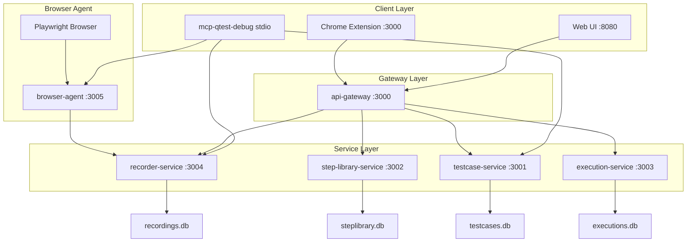
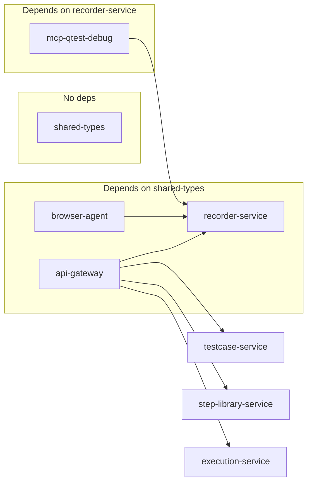
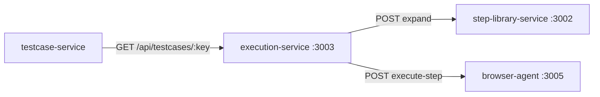

# Правила оформления тест-кейсов и баг-репортов (Zephyr Scale + Jira)

> **Полная документация проекта:** `qtest-runner/docs/` (VitePress-сайт). См. `CONTEXT_RULES.md → Documentation Reference`.

## Auto-Continue (автопродолжение)

- После завершения ответа **автоматически продолжай работу**, если задача не выполнена
- Не жди команд "continue", "продолжай", "дальше"
- Исключение: остановись, если нужны уточнения от пользователя
- Лимит: не более 15 tool-вызовов подряд без паузы (чтобы не спамить)

## Глобальные правила

Глобальные правила автопродолжения и сохранения контекста находятся в `~/.config/opencode/CONTEXT_RULES.md` — они применяются во всех проектах. Этот файл (AGENTS.md) содержит только специфику проекта TestQA.

## Принципы микросервисной архитектуры (Sam Newman)

При проектировании и разработке проекта строго следовать принципам микросервисной архитектуры из книги Сэма Ньюмана «Создание микросервисов» (2016):

### Ключевые принципы:

1. **Bounded Context (Ограниченный контекст)** — каждый микросервис владеет своей доменной областью. Никакой сервис не должен знать о внутренней структуре данных другого сервиса.

2. **Decentralized Data (Децентрализованные данные)** — каждый микросервис имеет собственную базу данных. Никакой сервис не обращается напрямую к БД другого сервиса — только через его API.

3. **Independent Deployability (Независимое развертывание)** — сервисы развертываются и обновляются независимо друг от друга. Изменение в одном сервисе не требует перезапуска других.

4. **Failure Isolation (Изоляция сбоев)** — отказ одного сервиса не должен каскадно обрушивать всю систему. Использовать circuit breakers, retries, timeouts.

5. **Smart Endpoints, Dumb Pipes** — бизнес-логика сосредоточена в сервисах, а не в канале передачи. Использовать простые HTTP/REST или асинхронные сообщения без ESB.

6. **Evolutionary Design (Эволюционное проектирование)** — архитектура должна позволять постепенно заменять и улучшать отдельные сервисы без перестройки всей системы.

7. **Technology Diversity** — сервисы могут использовать разные технологии, если это оправдано. Однако в рамках одного проекта для снижения сложности рекомендуется единый стек (TypeScript/Node.js).

8. **Organize Around Business Capabilities** — сервисы группируются вокруг бизнес-возможностей, а не технических слоев (не «слой данных», «слой логики», а «управление тест-кейсами», «исполнение тестов»).

### Правила для данного проекта:

- Каждый сервис — отдельная папка `packages/<service-name>/` в монорепозитории
- Каждый сервис имеет свой `package.json`, свой `tsconfig.json`, свою БД (SQLite файл)
- Коммуникация между сервисами — только через REST API (HTTP) или WebSocket
- Никакой сервис не импортирует код или типы из другого сервиса напрямую (только через shared типы в отдельном пакете)
- API Gateway (BFF) — единственная точка входа для Web UI и Chrome Extension
- Для отладки: каждый сервис запускается независимо (`npm run dev` в своей папке)
- При доработке одного сервиса изменять только его код, не трогая остальные

## Карта проекта (qtest-runner)

Монорепозиторий из 9 пакетов. Коммуникация — HTTP REST + WebSocket. Каждый сервис — независимый процесс со своей SQLite БД.

### Архитектура



### Пакеты

| Пакет | Путь | Порт | Назначение | БД |
|-------|------|------|------------|----|
| **shared-types** | `packages/shared-types` | — | Общие типы (интерфейсы, DTO) | — |
| **api-gateway** | `packages/api-gateway` | **3000** | BFF — единая точка входа для Web UI и Chrome Extension | — |
| **recorder-service** | `packages/recorder-service` | **3004** | Запись действий: сессии, action'ы, user_switch_config | `recordings.db` |
| **browser-agent** | `packages/browser-agent` | **3005** | Управление Playwright: инъекция скриптов, запись, executor | — |
| **testcase-service** | `packages/testcase-service` | **3001** | CRUD тест-кейсов, конвертация в Zephyr Scale | `testcases.db` |
| **step-library-service** | `packages/step-library-service` | **3002** | Библиотека шагов (Composite Steps) | `steplibrary.db` |
| **execution-service** | `packages/execution-service` | **3003** | Запуск и отслеживание выполнения тестов | `executions.db` |
| **web-ui** | `packages/web-ui` | **8080** | SPA (Vite + React) | — |
| **chrome-extension** | `packages/chrome-extension` | — | Chrome Extension для ручного тестирования | — |

### Ключевые файлы

| Файл | Описание |
|------|----------|
| `packages/browser-agent/src/inject-helpers.ts` | 15 INJECT_SCRIPT модулей (SHADOW, IFRAME, SPA_NAV, ERROR, ASSERTION, JIRA, COOKIE, CAPTCHA, TOUCH_WHEEL, DRAG, ANIMATION, LIFECYCLE, FILE_UPLOAD, USER_SWITCH, POPOVER, MEDIA_EVENTS) |
| `packages/browser-agent/src/recorder.ts` | INJECT_SCRIPT сборка, `formatActionDetail()`, `flushActions()`, `postJson()`, `stopRecording()` |
| `packages/browser-agent/src/executor.ts` | Выполнение шагов: Playwright actions, screenshots, switchTab, listTabs |
| `packages/browser-agent/src/ws-server.ts` | WebSocket сервер: 10+ endpoints, user_switch/switch, selectorActions forwarding |
| `packages/browser-agent/src/browser-manager.ts` | Управление браузером: launch, контексты, pages[], switchToPage() |
| `packages/browser-agent/src/action-parser.ts` | NLP парсинг: EN+RU паттерны для drag, switchTab, listTabs |
| `packages/recorder-service/src/db.ts` | SQLite: dynamic SQL, 35-column `recorded_actions`, `convertToSteps()`, user_switch_config |
| `packages/recorder-service/src/server.ts` | Express API: sessions, actions, user_switch config endpoints |
| `packages/shared-types/src/index.ts` | RecordedAction, StepCommand, RecordingSession и интерфейсы |

### Команды

| Команда | Описание |
|---------|----------|
| `npm run dev` (корень) | Запускает все сервисы через `concurrently` |
| `npm run build` | Собирает все TypeScript пакеты |
| `cd packages/<name> && npm run dev` | Запуск одного сервиса для отладки |

### Зависимости сервисов



---

## Best Practices: Playwright Recording (browser-agent)

### Архитектура записи действий (3 уровня)

```mermaid
graph TD
    A[User/Agent Action] --> B[Level 3: Executor]
    A --> C[Level 2: Browser Inject]
    A --> D[Level 1: Playwright Events]
    B --> E[pushAction → recorder]
    C --> E
    D --> E
    E --> F[flushActions (2s interval)]
    F --> G[POST /api/recordings/:id/actions]
    G --> H[recorder-service → SQLite]
    H --> I[convertToSteps → тест-кейсы]
```

### Новые модули (inject-helpers.ts)

| Модуль | Функция | Типы действий |
|--------|---------|---------------|
| `SHADOW_DOM_HELPER` | composedPath() + deepActiveElement() | click, fill внутри shadow root |
| `IFRAME_HELPER` | Рекурсивный frame selector path | frame[name="..."] >> selector |
| `SPA_NAV_HELPER` | monkey-patch pushState/replaceState + popstate/hashchange | navigate (spaMethod) |
| `ERROR_TRACKER_HELPER` | window.onerror + unhandledrejection | js_error, unhandled_rejection |
| `ASSERTION_HELPER` | Генерация ожидаемого результата | assertText, assertValue, assertChecked |
| `JIRA_DETECTOR_HELPER` | Детекция AUI, Froala, Zephyr, plugin iframe'ы | jira_env (informational) |
| `COOKIE_CONSENT_HELPER` | OneTrust, CookieYes, Cookiebot, generic | cookie_consent |
| `TOUCH_WHEEL_HELPER` | touchstart/touchend/touchmove + wheel | touchstart, touchend, touchmove, wheel |
| `ANIMATION_HELPER` | transitionend/start + animationend/start | transition_end, animation_end |
| `LIFECYCLE_HELPER` | visibilitychange + pagehide/pageshow + dialog + details | visibility_change, dialog_element, details_toggle |
| `FILE_UPLOAD_HELPER` | input type="file" change | file_upload |

### Уровень 1: Playwright-level (`page.on`, `context.on`)

| Событие | Что ловит |
|---------|-----------|
| `context.on('framenavigated')` | Навигация фрейма (включая iframe) |
| `page.on('load')` | Страница загружена |
| `context.on('page')` | Новая вкладка открыта |
| `page.on('request')` | HTTP запрос |
| `page.on('response')` | HTTP ответ |
| `page.on('requestfailed')` | HTTP ошибка |
| `page.on('console')` | Сообщения консоли (включая `__QTEST_ACTION__`) |
| `page.on('dialog')` | alert/confirm/prompt |
| `page.on('pageerror')` | JS ошибки |
| `context.recordVideo` | Видеозапись всей сессии (dir=videos, size=1440x900) |

### Уровень 2: Browser inject DOM-события

| Событие | Что ловит | debounce |
|---------|-----------|----------|
| `click` (через composedPath) | Клик — корректно проникает через shadow boundary | нет |
| `canvas` в click handler | Canvas click с координатами (offsetX, offsetY) | нет |
| `dblclick` | Двойной клик | нет |
| `selectionchange` | Выделение текста (отслеживание selection) | 400ms |
| `input` | Ввод текста | 500ms |
| `change` | select, checkbox, radio, file | нет |
| `keydown` | Enter, Tab, Escape, стрелки, комбинации | нет |
| `focusin` | Фокус на элементе | нет |
| `contextmenu` | Правый клик (x, y) | нет |
| `dragstart/dragend/drop` | Перетаскивание | нет |
| `submit` | Отправка формы | нет |
| `scroll` | Прокрутка | 800ms |
| `mouseenter/mouseleave` | Ховер (только для кнопок/ссылок) | нет |
| `resize` | Изменение окна | 500ms |
| `copy/paste` | Буфер обмена | нет |
| `touchstart/touchend/touchmove` | Touch-события | нет |
| `wheel` | Колёсико мыши (deltaX/deltaY) | нет (passive) |
| `transitionend/start` | CSS transition | нет |
| `animationend/start` | CSS animation | нет |
| `visibilitychange` | Видимость вкладки | нет |
| `toggle` (details) | Разворот/сворачивание details | нет |
| MutationObserver | element_appear, element_remove, attr_change, text_change | 500ms |
| Cookie Consent | OneTrust, CookieYes, Cookiebot | 1s timeout |
| Jira Detector | AUI, Froala, Zephyr, plugin iframe'ы | при старте |

### Уровень 3: Executor recording

После каждого `execute-step` executor явно вызывает `pushAction()`:
- navigate, click (с опциональными position x,y для canvas), fill, select, check, keypress, drag, scroll, wait, verify
- **hover, dragTo, wheel, touch, fileUpload, waitForSelector**
- **assertText, assertVisible, assertValue, assertChecked, assertUrl**

### SPA Навигация (новое)

**Проблема:** setInterval polling — ненадёжный, пропускает pushState, не ловит reload.

**Решение:** Monkey-patch history API:
- `history.pushState()` — перехвачен
- `history.replaceState()` — перехвачен
- `popstate` — событие
- `hashchange` — событие

Playwright-level `framenavigated` остаётся для обычной навигации.

### Shadow DOM (улучшено)

**Проблема:** Старый код использовал `e.target` — не проникает через shadow boundary.

**Решение:**
- `__deepEventTarget(event)` — использует `event.composedPath()[0]`
- `__deepActiveElement(root)` — рекурсивно проникает через shadowRoot.activeElement
- Все обработчики событий используют `__deepEventTarget`
- Поддержка open shadow roots (MutationObserver сканирует)
- Shadow root event listeners также используют composedPath

### iframe (новое)

**Same-origin iframe:**
- `__getFrameSelector(frameWin)` — генерирует frame[name="..."] / #frameId
- `__getFramePath(win)` — рекурсивный путь до корневого окна
- Запись в convertToSteps: `В iframe "frameName" нажать...`

**Cross-origin iframe:** postMessage bridge (TODO)

### Error Tracking (новое)

| Событие | Тип | Детали |
|---------|-----|--------|
| window.onerror | `js_error` | message, filename, lineno, stack |
| unhandledrejection | `unhandled_rejection` | message, stack |
| page.on('pageerror') | `js_error` | Playwright-level |

### Cookie Consent (новое)

Авто-детекция баннеров: OneTrust (#onetrust-banner-sdk), CookieYes (.cky-consent-container), Cookiebot (#cookiebanner), generic (.cookie-banner, .gdpr-cookie). Записывается как `cookie_consent`.

### Assertion Engine (новое)

Генерирует ожидаемый результат на основе контекста:
- После клика: проверяет изменился ли URL
- После fill: "Поле содержит значение"
- После submit: "Форма отправлена"
- После навигации: "Страница загружена: <title>"

### Добавление нового типа действия (checklist)

- [ ] 1. В `inject-helpers.ts` добавить обработчик
- [ ] 2. В `recorder.ts` в `INJECT_SCRIPT` добавить код в нужное место
- [ ] 3. В `recorder.ts` в `formatActionDetail()` добавить case
- [ ] 4. В `executor.ts` в switch добавить case
- [ ] 5. В `action-parser.ts` в ParsedCommand + parseStep добавить паттерн
- [ ] 6. В `recorder-service/src/db.ts` в `convertToSteps()` добавить case
- [ ] 7. В mcp-qtest-debug/src/index.ts добавить в testcase format
- [ ] 8. В `ws-server.ts` добавить action в selectorActions + fallback if commands.length===0

### Критические правила для action-parser.ts

1. **Все сравнения в lowercase**: `const a = action.trim().toLowerCase()` → сравнение только с `'asserttext'`, **НЕ** `'assertText'`
2. **Не устанавливать selector из testData**: `parseStep(action, testData, expectedResult)` — testData это value, не selector. Все selector'ы приходят от `body.selector` в `ws-server.ts`
3. **Формат команды**: `{ action, value?, text?, file? }` — selector проставляется в ws-server.ts

### Критические правила для ws-server.ts

1. **parseStep вызов**: `parseStep(body.action, body.testData || body.value, body.expectedResult)`
2. **selector forwarding**: только `if (!cmd.selector)` чтобы не перезаписывать существующий
3. **selectorActions**: список всех действий, использующих selector
4. **fallback commands**: при `commands.length === 0 && body.action` — создать команду для assertText/assertVisible/assertValue/assertChecked/waitForSelector/fileUpload

### Критические правила для executor.ts

1. **Нет дублирования case**: `case 'drag':` и `case 'dragTo': case 'drag':` — конфликт (второй никогда не выполнится)
2. **parser-agnostic аргументы**: executor получает уже сформированный StepCommand — не полагаться на parseStep формат

### Как работает flush

- Каждые 2 секунды `flushActions()` отправляет накопленные действия в recorder-service
- При ошибке отправки действия возвращаются обратно в очередь
- При `stopRecording()` remaining actions отправляются и слушатели снимаются

### Лучшие практики из Playwright best practices

1. **Auto-waiting** — Playwright сам ждёт готовности элемента перед действием
2. **Role-based locators** — `getByRole` вместо CSS селекторов (более устойчивы к изменениям UI)
3. **Web-first assertions** — `expect(locator).toHaveText()` вместо ручных проверок
4. **Page Object Model** — разделять локаторы и тестовую логику
5. **Fixtures** — переиспользовать настройки тестового окружения
6. **Network mocking** — перехватывать и мокать сетевые запросы
7. **Trace viewer** — записывать трассировку для отладки
8. **Parallel execution** — запускать тесты параллельно для скорости
9. **Retries** — повторять упавшие тесты (но НЕ для flaky)
10. **Test isolation** — каждый тест должен быть независимым
11. **composedPath()** — всегда использовать для событий внутри shadow DOM
12. **deepActiveElement()** — рекурсивный поиск активного элемента через shadow boundary

## Composite Steps (step-library-service)

### Что такое Composite Step

Composite Step — это последовательность шагов, объединённая в один переиспользуемый блок. Например, «Авторизация в Jira» = [navigate → fill username → fill password → click login]. Composite steps могут содержать параметры (`{{paramName}}`), которые подставляются при разворачивании.

### Архитектура

```
Test Case Step (action='composite', testData='comp-jira-login')
  │
  ├─ POST /api/composite-steps/comp-jira-login/expand
  │     { bindings: { url, username, password } }
  │
  └─ Результат: [{ action:'navigate', value:'https://...' },
                  { action:'fill', selector:'#username', value:'admin' },
                  { action:'fill', selector:'#password', value:'pass123' },
                  { action:'click', selector:'#login-button' }]
```

### Поток выполнения (execution-service)

1. `POST /api/executions` с testCaseKey
2. Для каждого шага с `action === 'composite'`:
   - Извлекается `compositeId` из `testData` (например, `comp-jira-login`)
   - Извлекаются `bindings` из `expectedResult` (JSON: `{ bindings: { ... } }`)
   - Вызывается `POST /api/composite-steps/:id/expand` с bindings
   - Развёрнутые шаги вставляются в `step_results` вместо одного composite
3. При `auto-next` composite шаги (если остались неразвёрнутыми) пропускаются

### API endpoints (step-library-service, порт 3002)

| Endpoint | Метод | Описание |
|----------|-------|----------|
| `/api/composite-steps` | GET | Список всех composite steps (с items). Опциональный query: `?category=...` |
| `/api/composite-steps/:id` | GET | Получить один composite step с items |
| `/api/composite-steps` | POST | Создать новый composite step. Body: `{ name, description?, category?, parameters?, steps[] }` |
| `/api/composite-steps/:id` | PUT | Обновить composite step (partial update). Body: `{ name?, description?, category?, parameters?, steps? }` |
| `/api/composite-steps/:id` | DELETE | Удалить composite step (каскадно удаляет items) |
| `/api/composite-steps/:id/expand` | POST | Развернуть в плоские шаги. Body: `{ bindings: { paramName: value } }` |
| `/api/composite-categories` | GET | Список уникальных категорий composite steps |

### Формат composite step

```json
{
  "id": "comp-jira-login",
  "name": "Авторизация в Jira",
  "description": "Вход в Jira: открыть страницу логина, ввести логин/пароль, нажать Войти",
  "category": "Авторизация",
  "parameters": [
    { "name": "url", "label": "URL Jira", "type": "url", "required": true },
    { "name": "username", "label": "Логин", "type": "string", "required": true },
    { "name": "password", "label": "Пароль", "type": "string", "required": true }
  ],
  "steps": [
    { "action": "navigate", "url": "{{url}}", "text": "Открыть страницу логина Jira" },
    { "libraryStepId": "lib-fill-field", "selector": "#username", "value": "{{username}}" },
    { "libraryStepId": "lib-fill-field", "selector": "#password", "value": "{{password}}" },
    { "libraryStepId": "lib-click-btn", "selector": "#login-button" }
  ]
}
```

### Формат expand response

```json
{
  "id": "comp-jira-login",
  "name": "Авторизация в Jira",
  "description": "Вход в Jira: открыть страницу логина, ввести логин/пароль, нажать Войти",
  "parameters": [...],
  "expanded": [
    { "index": 0, "action": "navigate", "selector": "", "value": "", "url": "https://jira.example.com/login", "text": "Открыть страницу логина Jira" },
    { "index": 1, "action": "fill", "selector": "#username", "value": "admin", "url": "", "text": "Ввести текст в указанное поле" },
    { "index": 2, "action": "fill", "selector": "#password", "value": "pass123", "url": "", "text": "Ввести текст в указанное поле" },
    { "index": 3, "action": "click", "selector": "#login-button", "value": "", "url": "", "text": "Нажать на кнопку с указанным текстом" }
  ]
}
```

### Зависимости composite steps в execution



### DB схема (steps.db)

```sql
CREATE TABLE composite_steps (
  id TEXT PRIMARY KEY,
  name TEXT NOT NULL,
  description TEXT DEFAULT '',
  category TEXT DEFAULT '',
  parameters_json TEXT DEFAULT '[]',
  created_at TEXT DEFAULT (datetime('now')),
  updated_at TEXT DEFAULT (datetime('now'))
);

CREATE TABLE composite_step_items (
  id TEXT PRIMARY KEY,
  composite_id TEXT NOT NULL,
  sort_order INTEGER NOT NULL DEFAULT 0,
  library_step_id TEXT,
  action TEXT NOT NULL,
  selector TEXT DEFAULT '',
  value TEXT DEFAULT '',
  url TEXT DEFAULT '',
  text TEXT DEFAULT '',
  parameter_bindings_json TEXT DEFAULT '{}',
  FOREIGN KEY (composite_id) REFERENCES composite_steps(id) ON DELETE CASCADE
);
```

### Seed данные

При старте step-library-service создаются 3 composite step:

| ID | Название | Шагов | Параметры |
|----|----------|-------|-----------|
| `comp-jira-login` | Авторизация в Jira | 4 | url, username, password |
| `comp-create-task` | Создание задачи в Jira | 4 | project, summary, description |
| `comp-screenshot-verify` | Скриншот и проверка текста | 2 | text |

### Правила

1. **{{param}} подстановка** — любое поле (action, selector, value, url, text) может содержать `{{paramName}}`, который заменяется значением из bindings при expand
2. **libraryStepId** — опциональная ссылка на `library_steps`; если action пустой — берётся из library step; если text пустой — берётся description из library step
3. **parameters** — массив `IStepParameter[]` (name, label, type, required, defaultValue) — только для документации/UI, не влияет на expand
4. **Bindings из expectedResult** — при создании execution bindings передаются через `expectedResult: { "bindings": { "url": "...", "username": "...", "password": "..." } }`
5. **execution-service pre-fetch** — все composite steps разворачиваются ДО транзакции, т.к. HTTP вызовы не могут быть внутри synchronous better-sqlite3 transaction
